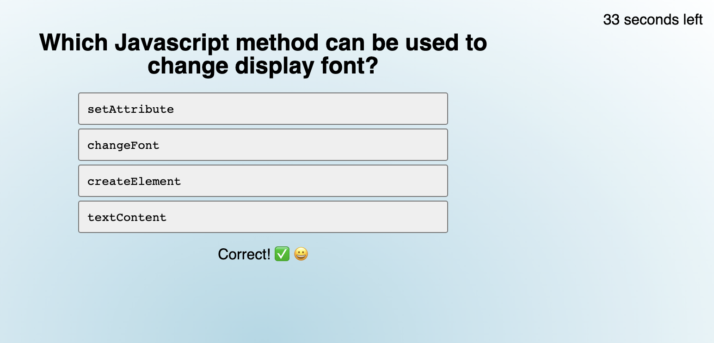

# module-4-coding-quiz
## Purpose
This project required using HTML, CSS and Javascript to build from scratch an interactive quiz that etc etc...

## Coding Process and Obstacles
Beginning with the HTML wireframe, I etc etc...

I encountered a major roadblock in my Javascript in trying to write the code for the questions generation and display. Elegance, iteration, scope of functions and for loops, etc...

Another challenge was etc etc...

## Credits
So far it's all me and odds and ends from W3 Schools, dev.to for nested arrays,

Here is a screenshot:

I hope you appreciate this password generator, you can try it for yourself at the [deployed GitHub webpage.] (https://etc)